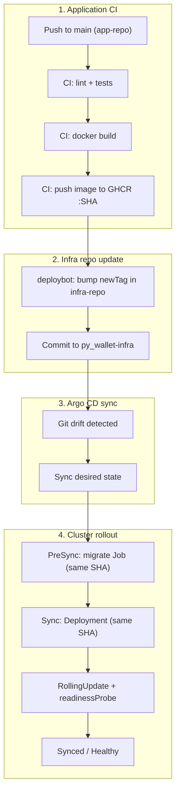

# py_wallet-infra

GitOps repository for the **py_wallet** project: Kubernetes manifests and Argo CD Applications (app-of-apps), with pull-based deployments.

## Production Readiness Status

| Area | Status | Current state | Next step |
|---|---|---|---|
| GitOps | Done | Argo CD app-of-apps, pull-based deploy | AppProject hardening |
| CI/CD | Done | GHCR image by SHA, infra tag bump | Image signing / SBOM |
| Kubernetes runtime | Done | Deployment, Service, Ingress, probes, resources | HPA/PDB |
| Database migrations | Done | Argo CD PreSync Alembic Job | Expand/contract migration policy |
| TLS | Done | cert-manager + Let's Encrypt | Certificate expiry alert |
| Secrets | Done | SealedSecrets in git (`postgres-secret`, `py-wallet-secrets`) | Backup controller master key offline |
| Monitoring | Done | kube-prometheus-stack + ServiceMonitor + dashboard | Alerts/SLO |
| Security hardening | Partial | ServiceAccount, no CI cluster access, JWT checks | NetworkPolicy, securityContext |
| Backup/restore | Planned | Not implemented | pg_dump CronJob + restore runbook |

See [`docs/releases/v0.1.md`](docs/releases/v0.1.md) for the platform release summary.
See [`docs/telegram-mini-app.md`](docs/telegram-mini-app.md) for Telegram Mini
App, bot token, and daily balance scheduler operations.

## Pull request validation

Same-repository pull requests are validated before auto-merge is enabled. The
workflow renders every Kustomize root with pinned Kustomize, validates built-in
Kubernetes resources and repository CRDs with pinned Kubeconform/catalog
versions, rejects mutable `:latest` images, and rejects plaintext Kubernetes
`Secret` resources.

For the local render and policy checks, install Kustomize and run:

```bash
rendered_dir="$(mktemp -d)"
scripts/render-manifests.sh "${rendered_dir}"
scripts/check-manifest-policy.sh "${rendered_dir}"
```

Kubeconform runs in CI because schema validation downloads the pinned schema
set. A failing validation job prevents the auto-merge job from running.

## Goals

Move away from push deploys from CI (`kubectl` + kubeconfig) to GitOps:

| Layer | Responsibility |
|-------|----------------|
| **app-repo** | Tests → Docker build → push image to GHCR |
| **deploybot / CI bot** | Bump image tag in this repo only (no cluster access) |
| **Argo CD** | Sync desired state from git into the cluster |
| **PreSync hook** | Run `alembic upgrade head` before rolling out the Deployment |

## Deploy flow



## Repository layout

```
py_wallet-infra/
├── bootstrap/
│   └── root-app.yaml          # Root Argo CD Application (apply once)
├── apps/
│   ├── cluster.yaml           # Argo Application → manifests/cluster
│   ├── postgres.yaml          # Argo Application → manifests/postgres
│   └── py-wallet.yaml         # Argo Application → manifests/app
└── manifests/
    ├── cluster/               # Namespace, cert-manager ClusterIssuers, …
    ├── postgres/              # Postgres StatefulSet + SealedSecret
    └── app/                   # App Deployment, Ingress, migrate Job, SealedSecret, …
```

## Image versioning

The single source of truth for the app image tag is [`manifests/app/kustomization.yaml`](manifests/app/kustomization.yaml):

```yaml
images:
  - name: ghcr.io/amysyutin/py_wallet
    newTag: <SHA>   # updated by deploybot after each successful build
```

Both the **Deployment** and the **PreSync migrate Job** use the same image reference so migrations and rollout always run the same build.

## Argo CD bootstrap

1. Install Argo CD in the cluster (outside this repo; see your k8sops/bootstrap tooling).
2. Apply the root Application once:

   ```bash
   kubectl apply -f bootstrap/root-app.yaml
   ```

3. Argo CD creates child Applications from `apps/` and syncs `manifests/*` automatically.

Child Applications target the in-cluster API server:

```yaml
destination:
  server: https://kubernetes.default.svc
```

## Secrets (SealedSecrets)

Sensitive values live in git as **encrypted** `SealedSecret` resources; the Bitnami controller in the cluster decrypts them into ordinary `Secret` objects at sync time.

| Secret | Namespace | Keys |
|--------|-----------|------|
| `postgres-secret` | `py-wallet-data` | `POSTGRES_USER`, `POSTGRES_PASSWORD`, `POSTGRES_DB` |
| `py-wallet-secrets` | `py-wallet-dev` | `DATABASE_URL`, `JWT_SECRET` |
| `telegram-bot-secret` | `py-wallet-dev` | `TELEGRAM_BOT_TOKEN` |

Manifests: [`manifests/postgres/sealed-postgres-secret.yaml`](manifests/postgres/sealed-postgres-secret.yaml), [`manifests/app/sealed-py-wallet-secrets.yaml`](manifests/app/sealed-py-wallet-secrets.yaml).

The Telegram secret is intentionally not present until it is sealed for the
target cluster. Its references are optional, so the website remains deployable
without it. Follow the [Telegram Mini App runbook](docs/telegram-mini-app.md) to
create and commit only the encrypted SealedSecret.

**Rotate or add a secret:** generate a plaintext `Secret` locally, pipe through `kubeseal`, commit the resulting `SealedSecret` (never commit plaintext).

```bash
kubectl create secret generic py-wallet-secrets \
  -n py-wallet-dev \
  --from-literal=DATABASE_URL='...' \
  --from-literal=JWT_SECRET='...' \
  --dry-run=client -o yaml \
| kubeseal --format yaml \
  --controller-namespace kube-system \
  --controller-name sealed-secrets \
> manifests/app/sealed-py-wallet-secrets.yaml
```

**PreSync ordering:** the app `SealedSecret` is a PreSync hook with `sync-wave: "-1"` so `py-wallet-secrets` exists before the Alembic migrate Job (`sync-wave: "0"`). The migrate Job only mounts the DB secret (not the app ConfigMap).

**Outside git:** backup the Sealed Secrets controller master key (loss = re-seal all secrets on a new cluster):

```bash
kubectl get secret -n kube-system \
  -l sealedsecrets.bitnami.com/sealed-secrets-key \
  -o yaml > sealed-secrets-master.key.yaml   # store offline, not in git
```

## Security model

- **No plaintext secrets in git** — only `SealedSecret` ciphertext; decryption happens in-cluster.
- **No CI cluster access** — GitHub Actions does not use kubeconfig or deploy RBAC; only Argo CD applies manifests.
- **Legacy `ci-deployer` RBAC removed** — was used for the old push-deploy model.

## Related repositories

| Repo | Role |
|------|------|
| [py_wallet](https://github.com/amysyutin/py_wallet) | Application source, CI build & push to GHCR |
| **py_wallet-infra** (this repo) | GitOps manifests and Argo CD apps |

## License

MIT
