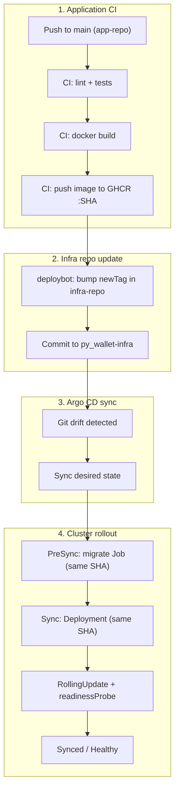

# py_wallet-infra

GitOps repository for the **py_wallet** project: Kubernetes manifests and Argo CD Applications (app-of-apps), with pull-based deployments.

## Goals

Move away from push deploys from CI (`kubectl` + kubeconfig) to GitOps:

| Layer | Responsibility |
|-------|----------------|
| **app-repo** | Tests → Docker build → push image to GHCR |
| **deploybot / CI bot** | Bump image tag in this repo only (no cluster access) |
| **Argo CD** | Sync desired state from git into the cluster |
| **PreSync hook** | Run `alembic upgrade head` before rolling out the Deployment |

## Deploy flow



## Repository layout

```
py_wallet-infra/
├── bootstrap/
│   └── root-app.yaml          # Root Argo CD Application (apply once)
├── apps/
│   ├── cluster.yaml           # Argo Application → manifests/cluster
│   ├── postgres.yaml          # Argo Application → manifests/postgres
│   └── py-wallet.yaml         # Argo Application → manifests/app
└── manifests/
    ├── cluster/               # Namespace, cert-manager ClusterIssuers, …
    ├── postgres/              # Postgres StatefulSet + Service
    └── app/                   # App Deployment, Ingress, migrate Job, …
```

## Image versioning

The single source of truth for the app image tag is [`manifests/app/kustomization.yaml`](manifests/app/kustomization.yaml):

```yaml
images:
  - name: ghcr.io/amysyutin/py_wallet
    newTag: <SHA>   # updated by deploybot after each successful build
```

Both the **Deployment** and the **PreSync migrate Job** use the same image reference so migrations and rollout always run the same build.

## Argo CD bootstrap

1. Install Argo CD in the cluster (outside this repo; see your k8sops/bootstrap tooling).
2. Apply the root Application once:

   ```bash
   kubectl apply -f bootstrap/root-app.yaml
   ```

3. Argo CD creates child Applications from `apps/` and syncs `manifests/*` automatically.

Child Applications target the in-cluster API server:

```yaml
destination:
  server: https://kubernetes.default.svc
```

## Security model

- **No secrets in git** — manifests reference Kubernetes `Secret` objects (`py-wallet-secrets`, `postgres-secret`) created out-of-band.
- **No CI cluster access** — GitHub Actions does not use kubeconfig or deploy RBAC; only Argo CD applies manifests.
- **Legacy `ci-deployer` RBAC removed** — was used for the old push-deploy model.

## Related repositories

| Repo | Role |
|------|------|
| [py_wallet](https://github.com/amysyutin/py_wallet) | Application source, CI build & push to GHCR |
| **py_wallet-infra** (this repo) | GitOps manifests and Argo CD apps |

## License

MIT
